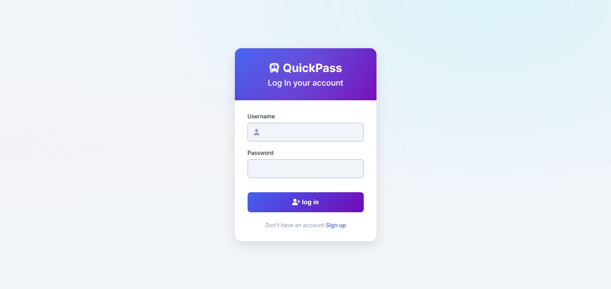
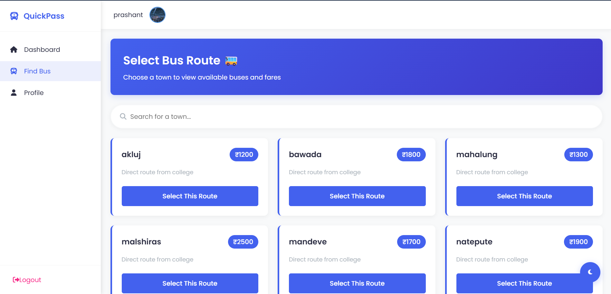
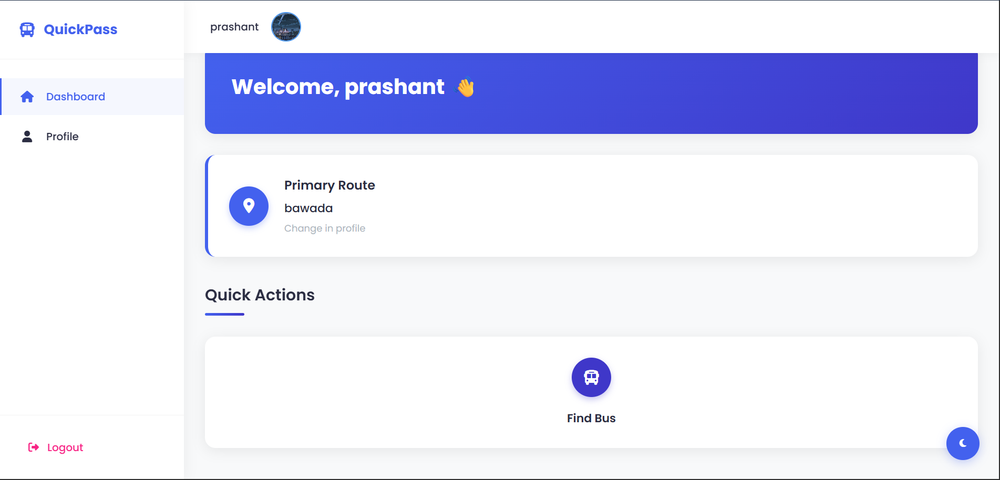
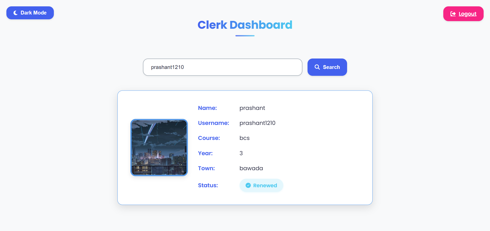
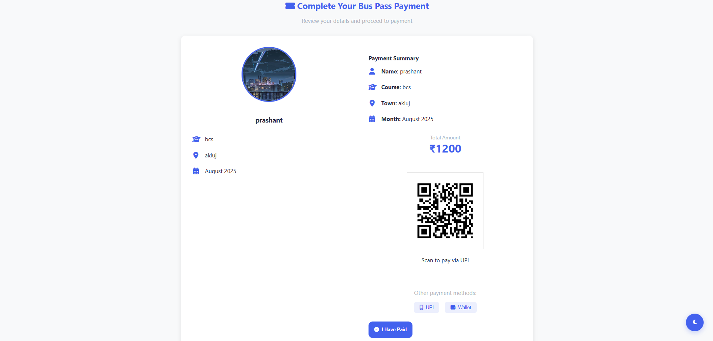
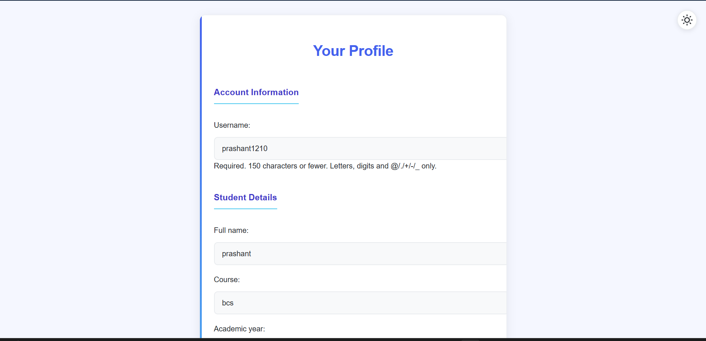
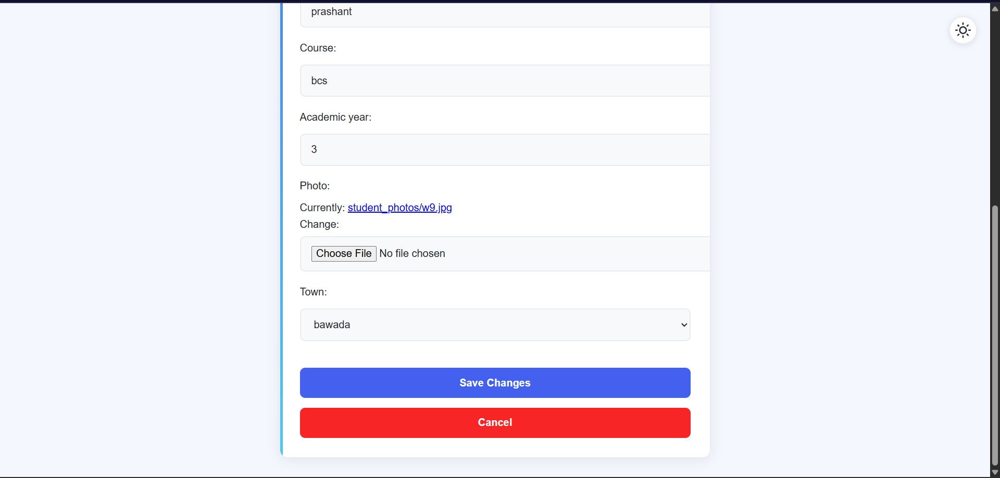

🚍 QuickPass – Student Bus Pass Management System
QuickPass is a Django-based web application that simplifies the process of applying, renewing, and managing student bus passes.
It allows students to register, select their town, pay via UPI QR code, and download a PDF pass — while clerks/admins can verify payments and manage student records.

✨ Features
🧑‍🎓 For Students
Create an account with full name, course, academic year, and profile photo
Select town to view dynamic bus pass pricing
Pay instantly using a QR code
Download a PDF bus pass with all details and photo
Check pass renewal status (✅ or ❌)

🧑‍💼 For Clerks/Admins
Login to a dedicated admin dashboard
Search students by name or ID
Verify payment and mark passes as renewed
View academic details, photo, and pass history

🛠️ Tech Stack
Layer	Technology Used
Backend	Python, Django
Frontend	HTML5, CSS3, JavaScript, Bootstrap
Database	SQLite (default, can be switched to MySQL/PostgreSQL)
File Handling	Pillow (image upload)
PDF Generation	ReportLab
Payments	QR Code (UPI)

📦 Installation & Setup
1️⃣ Clone the Repository:
git clone https://github.com/sarthak-4488/quickpass.git
cd quickpass

2️⃣ Create a Virtual Environment
Windows (PowerShell):
python -m venv env
.\env\Scripts\activate

macOS/Linux:
python3 -m venv env
source env/bin/activate

3️⃣ Install Dependencies:
pip install -r requirements.txt

4️⃣ Apply Database Migrations:
python manage.py migrate

5️⃣ Create a Superuser (Clerk/Admin Account)
python manage.py createsuperuser

Enter:
Username – Example: clerk1
Email – Optional
Password – Secure password for clerk login
Note: This account will be used by clerks to log in to the Admin Dashboard and manage student passes.

6️⃣ Run the Server
python manage.py runserver
Visit: http://127.0.0.1:8000/

📖 Usage Guide
🔹 Student Flow
Register with full name, username, password, course, academic year, and profile photo
Login to your dashboard
Select town → system displays the pass price and a QR code
Pay using any UPI app
Click "I Have Paid" → system marks your pass as renewed and generates a PDF
Download and print your pass
🔹 Clerk/Admin Flow
Login using the superuser account you created
Access Clerk Dashboard
Search students by name or ID
View student details: photo, course, town, academic year, payment status (✅/❌)
If payment is confirmed, click "Mark as Renewed"

📂 Project Structure
quickpass/
│── bus/              # Main app with models, views, and templates
│── media/            # Stores uploaded student photos
│── static/           # CSS, JS, and images
│── templates/        # HTML templates
│── manage.py         # Django management script
│── requirements.txt  # Dependencies
│── db.sqlite3        # Database (ignored in production)

📷 Screenshots
### 1. Login

### 2. Bus Selection

### 3. Dashboard

### 4. Clerk Dashboard

### 5. Payment

### 6. Profile

📜 License
This project is licensed under the MIT License – free to use, modify, and distribute.

📬 Contact
Author: Sarthak Revansiddha Chikhale
GitHub: sarthak-4488
Email: sarthakchikhale4488@gmail.com

